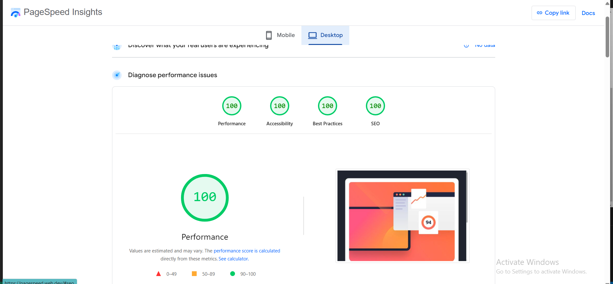

# Newsletter sign-up form with success message solution

This is a solution to the [Newsletter sign-up form with success message challenge on Frontend Mentor](https://www.frontendmentor.io/challenges/newsletter-signup-form-with-success-message-3FC1AZbNrv). Frontend Mentor challenges help you improve your coding skills by building realistic projects. 

## Table of contents

- [Overview](#overview)
  - [The challenge](#the-challenge)
  - [Screenshot](#screenshot)
  - [Links](#links)
- [My process](#my-process)
  - [Built with](#built-with)
  - [Error and Warning Log](#error-and-warning-log)
  - [Accessibility Report](#accessibility-report)
  - [Useful resources](#useful-resources)

## Overview

### The challenge

Users should be able to:

- Add their email and submit the form
- See a success message with their email after successfully submitting the form
- See form validation messages if:
  - The field is left empty
  - The email address is not formatted correctly
- View the optimal layout for the interface depending on their device's screen size
- See hover and focus states for all interactive elements on the page

### Screenshot

*Fig 1: Mobile Sign-up page*

*Fig 2: Mobile Error*

*Fig 3: Mobile success*

*Fig 4: Desktop sign-up page*

*Fig 5: Desktop Error*

*Fig 6: Desktop Success*

*Fig 7: Desktop Active*

### Links

- Solution URL: [Add solution URL here](https://your-solution-url.com)
- Live Site URL: [Newsletter sign-up form](https://charley95.github.io/NewsLetter-sign-up-form/)

## My process

### Built with

- Semantic HTML5 markup
- CSS custom properties
- Flexbox
- Mobile-first workflow
- JavaScript ES6

### Error and Warning Log

This documents all the errors and warnings encountered during the development of this project. I used the W3C-Validator to scan for structural and syntax errors and found no errors in my html and css codes.

### Accessibility Report

The image below shows a screenshot of the accessibilty report of my website generated using lighthouse.

### Useful resources

- [W3Schools](https://www.w3schools.com/)
- [Google](https://www.google.com) 
- [YouTube](https://www.youtube.com/)
- [W3C validator](https://validator.w3.org/)
- [CSS tricks](https://css-tricks.com/)
- [FreeCodeCamp](https://www.freecodecamp.org/)
- [Stack overflow](https://stackoverflow.com/questions)